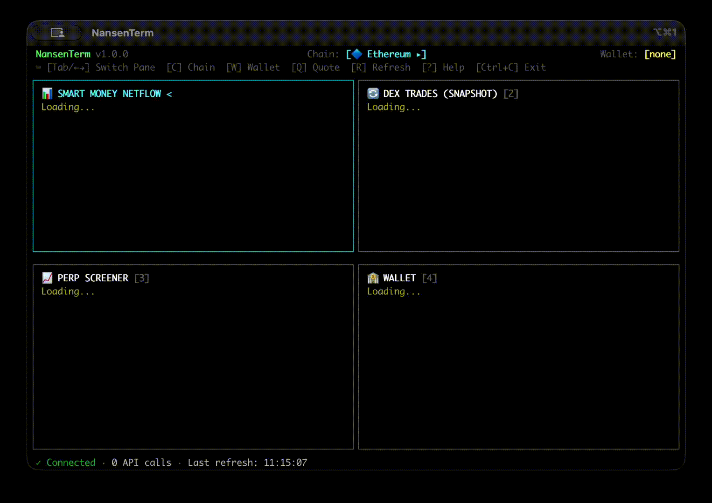
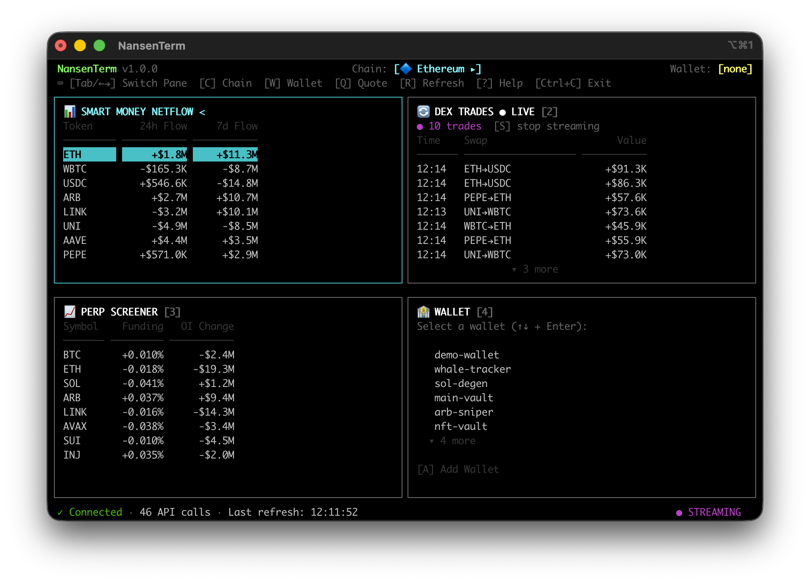
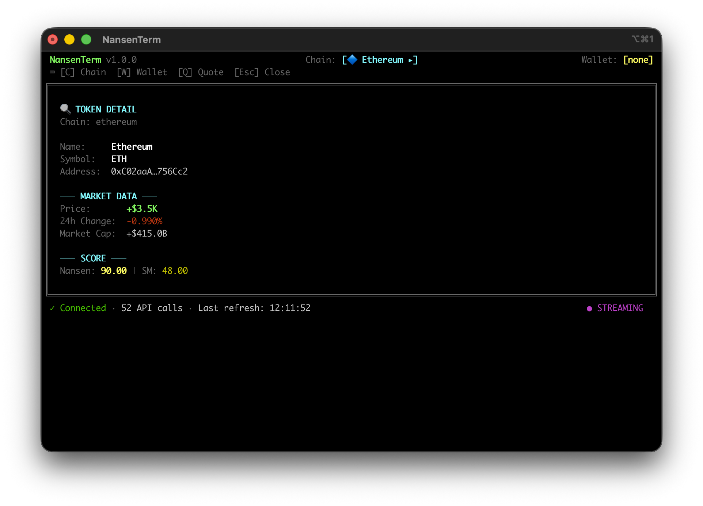

```
███╗   ██╗ █████╗ ███╗   ██╗███████╗███████╗███╗   ██╗████████╗███████╗██████╗ ███╗   ███╗
████╗  ██║██╔══██╗████╗  ██║██╔════╝██╔════╝████╗  ██║╚══██╔══╝██╔════╝██╔══██╗████╗ ████║
██╔██╗ ██║███████║██╔██╗ ██║███████╗█████╗  ██╔██╗ ██║   ██║   █████╗  ██████╔╝██╔████╔██║
██║╚██╗██║██╔══██║██║╚██╗██║╚════██║██╔══╝  ██║╚██╗██║   ██║   ██╔══╝  ██╔══██╗██║╚██╔╝██║
██║ ╚████║██║  ██║██║ ╚████║███████║███████╗██║ ╚████║   ██║   ███████╗██║  ██║██║ ╚═╝ ██║
╚═╝  ╚═══╝╚═╝  ╚═╝╚═╝  ╚═══╝╚══════╝╚══════╝╚═╝  ╚═══╝   ╚═╝   ╚══════╝╚═╝  ╚═╝╚═╝     ╚═╝
```

### The Hacker's Bloomberg Terminal — Interactive TUI for Nansen CLI

> *"Web apps are bloated. Real degens stay in the terminal."*

[](https://github.com/edycutjong/nansen-term/actions/workflows/ci.yml)
[](https://github.com/edycutjong/nansen-term)
[](LICENSE)
[](https://nodejs.org/)
[](https://nodejs.org/)
[](https://nodejs.org/)
[](https://github.com/edycutjong/nansen-term)

---

## 🎬 Demo



---

## ✨ Features

| | Feature | Description |
|---|---------|-------------|
| 📊 | **Multi-pane layout** | Smart Money flows, DEX trades, perp data, and wallet info side-by-side |
| 🔄 | **Live streaming** | NDJSON streaming for real-time DEX trade updates |
| ⌨️ | **Keyboard-first** | Tab between panes, arrow keys to scroll, hotkeys for everything |
| 💱 | **1-keystroke trading** | `[Q]` quote → `[T]` execute via `trade quote`/`trade execute` |
| 🔗 | **18-chain support** | Cycle through all chains with `[C]` |
| 📋 | **Clean tables** | Formatted ASCII tables, not raw JSON walls |

---

## 🚀 Quick Start

**Minimum requirement: just a Nansen API key.** No wallet needed to view analytics.

> **Terminal size:** minimum **120 columns × 32 rows**.
> For best experience, **160×40** (or full-screen iTerm2/Terminal) is recommended.

```bash
# 1. Install nansen-cli and authenticate
npm install -g nansen-cli
nansen login --api-key YOUR_API_KEY   # get key: app.nansen.ai/auth/agent-setup

# 2. Clone and run NansenTerm
git clone https://github.com/edycutjong/nansen-term.git
cd nansen-term
npm install
npm --silent run demo  # clean output, no npm preamble
# or: npm run dev      # development mode with hot reload
```

> **Wallet is optional.** Netflow, DEX Trades, and Perp panes work without one.
> Only `[Q]` trade quote and `[T]` execute require a wallet:
> ```bash
> nansen wallet create   # only needed for trading
> ```

---

## 📸 Screenshots

**Main Dashboard** — 4 panes with live DEX streaming:



**Token Detail Overlay** — deep-dive any token with `Enter`:



---

## ⌨️ Keyboard Shortcuts

| Key | Action |
|-----|--------|
| `Tab` / `Shift+Tab` | Cycle through panes |
| `↑` / `↓` | Scroll within active pane |
| `Enter` | Select token → open detail overlay |
| `C` | Cycle chain (ethereum → solana → base → ...) |
| `W` | Switch wallet |
| `Q` | Open trade quote modal |
| `T` | Execute quoted trade (confirmation required) |
| `R` | Refresh current pane |
| `P` | Refresh all panes |
| `S` | Toggle streaming mode |
| `?` | Help overlay |
| `Esc` | Close overlay / go back |
| `Ctrl+C` | Exit |

---

## 🛠 Tech Stack

| Layer | Technology |
|-------|------------|
| **Runtime** | Node.js 20+ |
| **TUI Framework** | [Ink v5](https://github.com/vadimdemedes/ink) (React for CLI) |
| **CLI Execution** | `child_process.execFile` / `spawn` |
| **State Management** | React hooks |
| **Streaming** | NDJSON via `--stream` flag |
| **Testing** | [Vitest](https://vitest.dev/) · 246 tests · Istanbul coverage |

---

## 🔌 Nansen CLI Endpoints

20+ endpoints across `research`, `trade`, and `wallet`:

```
research smart-money   netflow · dex-trades · holdings
research perp          screener · leaderboard
research token         info · indicators · ohlcv · screener · flow-intelligence
research profiler      balance · pnl-summary
research search
trade                  quote · execute
wallet                 list · show · create
account
```

---

## 🔗 Supported Chains

`ethereum` · `solana` · `base` · `bnb` · `arbitrum` · `polygon` · `optimism` · `avalanche` · `linea` · `scroll` · `mantle` · `ronin` · `sei` · `plasma` · `sonic` · `monad` · `hyperevm` · `iotaevm`

---

## 🧑‍💻 Development

```bash
npm run dev             # Run with tsx (hot reload)
npm run mock            # Run with mock data (uses zero API credits)
npm run build           # Compile TypeScript
npm start               # Run compiled version
npm test                # Run 246 tests with Vitest
npm run test:coverage   # Tests with Istanbul coverage report
```

> 💡 **Tip:** Use `npm run mock` to explore the full UI without consuming any Nansen API tokens.

---

## 🏆 Built For

Week 2 of the [Nansen CLI Build Challenge](https://x.com/nansen_ai) — `#NansenCLI`

---

## 📄 License

[MIT](LICENSE) © [edycutjong](https://github.com/edycutjong)
